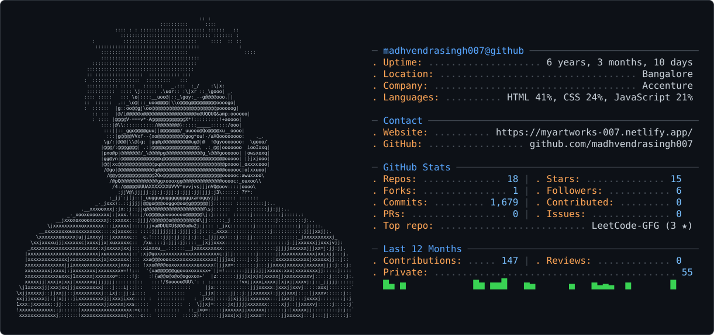

<!-- ============================================================ -->
<!--  gh-ascii PROFILE CARD — generated via gh.crafter.run        -->
<!--  Run the curl commands in the setup notes to fetch these,    -->
<!--  then commit dark_mode.svg + light_mode.svg to repo root.    -->
<!-- ============================================================ -->

<div align="center">
  
</div>

<div align="right">
  
</div>


<picture>
  <source media="(prefers-color-scheme: dark)" srcset="dark_mode.svg" />
  <source media="(prefers-color-scheme: light)" srcset="light_mode.svg" />
  
</picture>

<br/>

<div align="center">

```
┌─────────────────────────────────────────────────────────────────┐
│  root@madhvendra:~$ whoami                                      │
│  > Madhvendra Singh                                             │
│  root@madhvendra:~$ cat role.txt                                │
│  > Software Developer · Full-Stack · Problem Solver             │
└─────────────────────────────────────────────────────────────────┘
```

</div>


---

<div align="center">

```
░▒▓█  T E C H   A R S E N A L  █▓▒░
```

</div>

<table align="center" border="0" cellspacing="0" cellpadding="10">
  <tr>
    <td align="center" valign="top" width="33%">
      <b>Frontend</b><br/><br/>
      
    </td>
    <td align="center" valign="top" width="33%">
      <b>Backend &amp; Data</b><br/><br/>
      
    </td>
    <td align="center" valign="top" width="33%">
      <b>Tools &amp; Cloud</b><br/><br/>
      
    </td>
  </tr>
</table>

---

<div align="center">

```
░▒▓█  G I T H U B   A N A L Y T I C S  █▓▒░
```

</div>

<div align="center">
<picture>
  <source media="(prefers-color-scheme: dark)" srcset="https://streak-stats.demolab.com/?user=madhvendrasingh007&hide_border=true&background=0A101F&stroke=22D3EE&ring=A78BFA&fire=10B981&currStreakLabel=22D3EE&sideLabels=94A3B8&currStreakNum=F8FAFC&sideNums=F8FAFC&dates=64748B&titleColor=22D3EE&card_width=1180">
  
</picture>
<br/>
<picture>
  <source media="(prefers-color-scheme: dark)" srcset="https://github-readme-stats-sigma-rosy-28.vercel.app/api?username=madhvendrasingh007&show_icons=true&count_private=true&include_all_commits=true&hide_rank=true&hide_border=true&title_color=22D3EE&icon_color=A78BFA&text_color=94A3B8&bg_color=0A101F&card_width=500">
  
</picture>
<picture>
  <source media="(prefers-color-scheme: dark)" srcset="https://github-readme-stats-sigma-rosy-28.vercel.app/api/top-langs/?username=madhvendrasingh007&layout=compact&langs_count=8&hide_border=true&title_color=22D3EE&text_color=94A3B8&bg_color=0A101F&card_width=500">
  
</picture>
</div>

---

<div align="center">

```
░▒▓█  C O N T R I B U T I O N   S N A K E  █▓▒░
```

</div>

<div align="center">
<picture>
  <source media="(prefers-color-scheme: dark)" srcset="https://raw.githubusercontent.com/madhvendrasingh007/madhvendrasingh007/output/github-snake-dark.svg">
  <source media="(prefers-color-scheme: light)" srcset="https://raw.githubusercontent.com/madhvendrasingh007/madhvendrasingh007/output/github-snake.svg">
  
</picture>
</div>

---

<div align="center">

```
┌─────────────────────────────────────────────────────────────────┐
│  root@madhvendra:~$ cat contact.txt                             │
└─────────────────────────────────────────────────────────────────┘
```

  <a href="https://linkedin.com/in/madhvendra-singh-6592201a9/"></a>
  &nbsp;&nbsp;
  <a href="mailto:smadhvendra80@gmail.com"></a>
  &nbsp;&nbsp;
  <a href="https://myartworks-007.netlify.app/"></a>

</div>

<br/>

<div align="center">
  <h3>✨ Thanks for visiting! ✨</h3>
  <p><em>Happy Coding! 🚀 • Let's build something amazing! 💻 • Stay curious, stay creative! 🎨</em></p>
</div>

<div align="center">
  
</div>

